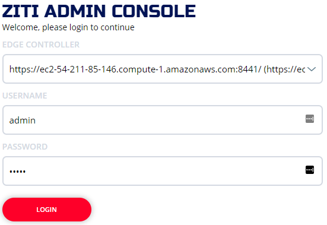
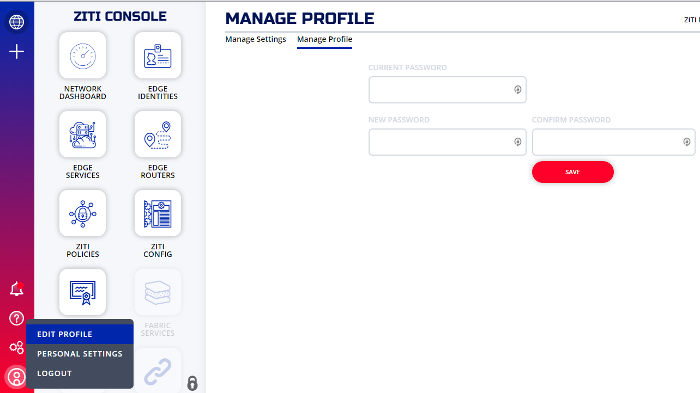

# Quickstart - AWS

This quickstart is a barebones guide to running a full developer environment in AWS. It is not fault-tolerant. If you require fault tolerance this guide is not for you. This guide also assumes you're at least familiar with AWS's console and cloud development. Feel free to replace any steps along the way you desire but these steps were tested at least a few times and hopefully whenever you're reading this, the steps are still valid. If not file an issue or shoot over to [Discourse](https://openziti.discourse.group/) and start a discussion.

## Setup a Server

1. After logging into AWS, navigate to the EC2 Dashboard
1. From the EC2 Dashboard, click "Launch Instance"
1. Find "Ubuntu Server 20.04 LTS (HVM), SSD Volume Type" and click 'select'
1. At the bottom of the screen - click the "Review and Launch" button
1. In AWS "Step 7. Review Instance Launch", find the "Security Groups" row and expand it if necessary
1. Click "Edit security groups"
1. Click "Add Rule" and select "Custom TCP Rule" and enter Port Range:"8441" Source: "0.0.0.0/0"
1. Click "Add Rule" and select "Custom TCP Rule" and enter Port Range:"8442" Source: "0.0.0.0/0"
1. Click "Add Rule" and select "Custom TCP Rule" and enter Port Range:"8443" Source: "0.0.0.0/0"
1. Your console should look like this:
   

1. click "Review and Launch" and then "Launch"
1. Select your keypair and choose "Launch Instances"

## SSH to the Server

1. After ssh'ing to the new ubuntu machine - run: sudo apt update && sudo apt install jq -y
1. Clone the public github repos: git clone https://github.com/openziti/ziti.git
1. Set a whole bunch of environment variables. You will need to know the public ip address as well as public dns name. Replace "____EXTERNAL___IP____" and "____EXTERNAL___DNS____" with the proper values:

       export EXTERNAL_IP="____EXTERNAL___IP____"export EXTERNAL_DNS="____EXTERNAL___DNS____"
       export ZITI_EDGE_CONTROLLER_IP_OVERRIDE="${EXTERNAL_IP}"
       export ZITI_EDGE_ROUTER_IP_OVERRIDE="${EXTERNAL_IP}"
       export ZITI_EDGE_CONTROLLER_HOSTNAME="${EXTERNAL_DNS}"
       export ZITI_EDGE_ROUTER_HOSTNAME="${EXTERNAL_DNS}"
       export ZITI_EDGE_CONTROLLER_PORT=8441
       export ZITI_EDGE_ROUTER_PORT=8442
1. Start the Ziti Controller and Ziti Edge Router by using the "express" script:

       ~/ziti/quickstart/local/express/express-dev-env.sh
1. Test the script worked properly by using a curl statement:

       curl -k "https://${EXTERNAL_DNS}:${ZITI_EDGE_CONTROLLER_PORT}/version"
       {"data":{"apiVersions":{"edge":{"v1":{"path":"/edge/v1"}}},"buildDate":"2021-05-05 20:59:40","revision":"73dd1db42bf4","runtimeVersion":"go1.16.3","version":"v0.19.13"},"meta":{}}

## Setting up the Ziti Admin Console

1. Install docker on the machine. I followed these instructions https://linuxize.com/post/how-to-install-and-use-docker-on-ubuntu-20-04/ but we'll condense them here for you to copy/paste:

       sudo apt update
       sudo apt install apt-transport-https ca-certificates curl gnupg-agent software-properties-common -y
       curl -fsSL https://download.docker.com/linux/ubuntu/gpg | sudo apt-key add -
       sudo add-apt-repository "deb [arch=amd64] https://download.docker.com/linux/ubuntu $(lsb_release -cs) stable"
       sudo apt install docker-ce docker-ce-cli containerd.io -y
       sudo usermod -aG docker $USER
1. Log out of the server, and log back in to activate docker for your user
1. Copy/paste this command to start the Ziti Admin Console in TLS mode:

       docker run -d \
       --name zac \
       -p 8443:8443 \
       -v "/home/ubuntu/.ziti/quickstart/$(hostname)/pki/$(hostname)-intermediate/keys/$(hostname)-server.key":/usr/src/app/server.key \
       -v "/home/ubuntu/.ziti/quickstart/$(hostname)/pki/$(hostname)-intermediate/certs/$(hostname)-server.chain.pem":/usr/src/app/server.chain.pem \
       openziti/zac
1. At this point you should be able to navigate to both: https://external-dns-name:8443 as well as https://external-ip:8443 and see the ZAC login screen. (The TLS warnings your browser will show you are normal - it's because these steps use a self-signed certificate generated in the install process)
1. Set the controller as shown:

   
1. Login with admin/admin

   

1. **IMPORTANT!!!** Edit your profile and change the password

   